<!-- Copyright by Vedansh (offensive-vk) 2020 - Present. All Rights Reserved. -->

<!-- This Readme Was Specially Handcrafted by @offensive-vk (https://github.com/offensive-vk) -->

<!-- This Readme has been translated regularly in 7 Major Languages of the entire world. -->

   <a href="https://github.com/offensive-vk">
      <picture>
           <source media="(prefers-color-scheme: dark)" srcset="./assets/mine-dark.svg" height="350" width="650" />
           <source media="(prefers-color-scheme: light)" srcset="./assets/mine-light.svg" height="350" width="650" />
           
     </picture>
   </a>

  

  - Don't Understand? Please Find Your Version Below -
   
    <a href="README.md">English</a>
    .
    <a href="README.es.md">Española</a>
    .
    <a href="README.fr.md">Français</a>
    ·
    <a href="README.ar.md">عربي</a>
    ·
    <a href="README.de.md">Deutsch</a>
    ·
    <a href="README.zh-CN.md">中国人</a>
    ·
    <a href="README.ru.md">Русский</a>
  

<!--
 -->

## 💫 Über mich:

🔭_Perfektion ist nicht das Ziel_. 🧑‍💻 Ich schreibe gerne am Computer**`code`**. 🤠Ich suche Hilfe bei der Dateiverwaltung auf meinem Computer. ✨ Leben im Inneren`terminal`. 🌱 Ich lerne gerade einiges_**böse**_Sachen. 💬 Frag mich nach nichts. 👌 Ich habe keine Freizeit, lol. âš¡ Lustige Tatsache: Kein Spaß, nur Code. 💥 Bleiben Sie in Bewegung und eines Tages werden Sie es schaffen. 📧_Du wirst einen Weg finden_.

<!--STARTS_HERE_QUOTE_README-->

<i>❝Apples erster Computer, der Apple I, kam 1976 für 666,66 US-Dollar auf den Markt, weil Steve Wozniak das Wiederholen von Ziffern mochte und es einfacher fand, sie zu tippen. Er sagte, er sei sich keiner satanischen Konnotation mit der Zahl bewusst.❞</i>

<!--ENDS_HERE_QUOTE_README-->

* * *

<h3 align="left" title="...and I'm happy to see you here :)">🧑‍💻 Languages and Tools: </h3>
    

        
        
        
        
        
        
        
        
        
        
        
        
        
        
        
        
        
        
        
    

<!-- Showing Stuff, that i dont care about lol. have fun -->

  
<h3>🚀 Expecting Something Better? Expand for more !</h3>

    

<!-- Outer switch START -->

  
<h4>💻 Click here to See Cool Stuff ⬇️</h4>

    <a href="https://github.com/offensive-vk">
       <picture>
        <source media="(prefers-color-scheme: dark)" srcset="https://ssr-contributions-svg.vercel.app/_/offensive-vk?chart=3dbar&gap=0.6&scale=2&flatten=2&animation=wave&animation_duration=4&animation_delay=0.06&animation_amplitude=24&animation_frequency=0.1&animation_wave_center=0_3&format=svg&weeks=34&theme=native&dark=true">
        <source media="(prefers-color-scheme: light)" srcset="https://ssr-contributions-svg.vercel.app/_/offensive-vk?chart=3dbar&gap=0.6&scale=2&flatten=2&animation=wave&animation_duration=4&animation_delay=0.06&animation_amplitude=24&animation_frequency=0.1&animation_wave_center=0_3&format=svg&weeks=34&theme=native">
        
      </picture>
    </a>

  
<h4>⭠Achievements & Awards ✅ </h4>

    

  
<h4>💻 Top Languages ✅</h4>

    

  
<h4>⚡ Recent Activity ✅</h4>

    

        
    

<!--START_SECTION:activity-->

1.  🎉 Zusammengeführte PR[#27474](https://github.com/offensive-vk/offensive-vk/pull/27474)In[offensive-vk/offensive-vk](https://github.com/offensive-vk/offensive-vk)
2.  🚀 Veröffentlichte Veröffentlichung[Inc](https://github.com/offensive-vk/auto-translate/releases/tag/v6)In[offensive-vk/automatische Übersetzung](https://github.com/offensive-vk/auto-translate)
3.  🎉 Zusammengeführte PR[#2](https://github.com/offensive-vk/auto-translate/pull/2)In[offensive-vk/automatische Übersetzung](https://github.com/offensive-vk/auto-translate)
4.  💪 PR eröffnet[#2](https://github.com/offensive-vk/auto-translate/pull/2)In[offensive-vk/automatische Übersetzung](https://github.com/offensive-vk/auto-translate)
5.  🎉 Zusammengeführte PR[#19](https://github.com/offensive-vk/TypedScript/pull/19)In[offensive-vk/TypedScript](https://github.com/offensive-vk/TypedScript)
6.  💪 PR eröffnet[#19](https://github.com/offensive-vk/TypedScript/pull/19)In[offensive-vk/TypedScript](https://github.com/offensive-vk/TypedScript)
7.  🎉 Zusammengeführte PR[#27472](https://github.com/offensive-vk/offensive-vk/pull/27472)In[offensive-vk/offensive-vk](https://github.com/offensive-vk/offensive-vk)
8.  🎉 Zusammengeführte PR[#1](https://github.com/offensive-vk/auto-translate/pull/1)In[offensive-vk/automatische Übersetzung](https://github.com/offensive-vk/auto-translate)
9.  🚀 Veröffentlichte Veröffentlichung[Inc](https://github.com/offensive-vk/auto-repo-sync/releases/tag/v6)In[offensive-vk/auto-repo-sync](https://github.com/offensive-vk/auto-repo-sync)
10. 🎉 Zusammengeführte PR[#1](https://github.com/offensive-vk/auto-pr-action/pull/1)In[offensive-vk/auto-pr-action](https://github.com/offensive-vk/auto-pr-action)
11. 🎉 Zusammengeführte PR[#27464](https://github.com/offensive-vk/offensive-vk/pull/27464)In[offensive-vk/offensive-vk](https://github.com/offensive-vk/offensive-vk)
12. 🎉 Zusammengeführte PR[#258](https://github.com/offensive-vk/UntilEverything/pull/258)In[offensive-vk/UntilEverything](https://github.com/offensive-vk/UntilEverything)
13. 🎉 Zusammengeführte PR[#27458](https://github.com/offensive-vk/offensive-vk/pull/27458)In[offensive-vk/offensive-vk](https://github.com/offensive-vk/offensive-vk)
14. 🔒Geschlossenes Problem[#27040](https://github.com/offensive-vk/offensive-vk/issues/27040)In[offensive-vk/offensive-vk](https://github.com/offensive-vk/offensive-vk)
15. 🎉 Zusammengeführte PR[#5](https://github.com/offensive-vk/AwesomeActions/pull/5)In[offensive-vk/AwesomeActions](https://github.com/offensive-vk/AwesomeActions)
    <!--END_SECTION:activity-->

* * *

➡️ Was? Lust auf mehr Aktivität?**[Klicken Sie hier](./RECENT.md)**

    
<h4>📊 Github Metrics ✅</h4>

    <picture>
        <source media="(prefers-color-scheme: dark)" srcset="./profile-3d-contrib/profile-night-green.svg" width=600 height=400 alt='metrics' />
        <source media="(prefers-color-scheme: light)" srcset="./profile-3d-contrib/profile-green.svg" width=600 height=400 alt='metrics' />
        
    </picture>
    

<!--

  
<h4>👻 Quick Snapshot of Past ✅</h4>

    

-->

    
<h4>🐍 Do you like snakes? ✅</h4>

    

      <picture>
        <source media="(prefers-color-scheme: dark)" srcset="https://github.com/offensive-vk/offensive-vk/blob/master/assets/github-snake-dark.svg" height=250 width=850 alt="snake" />
        <source media="(prefers-color-scheme: light)" srcset="https://github.com/offensive-vk/offensive-vk/blob/master/assets/github-snake-light.svg" height=250 width=850 alt="snake" />
        
     </picture>
    

    
<h4>🹠CI and Workflow Status ✅</h4>

**Möchten Sie alles sehen?**[Klicken Sie hier](https://github.com/offensive-vk/offensive-vk/actions)

**Möchten Sie die Workflow-Datei sehen?**[Klicken Sie hier](https://github.com/offensive-vk/offensive-vk/tree/master/WORKFLOWS.md)

**Möchten Sie Repository-Statistiken sehen?**[Klicken Sie hier](https://github.com/offensive-vk/offensive-vk/tree/master/STATS.md)

* * *

  <i>&copy; <a href="https://github.com/offensive-vk/">Vedansh </a> 2020 - Present</i> 
  <i>Licensed under <a href="https://github.com/offensive-vk/offensive-vk/tree/master/LICENSE">GNU Affero General Public License</a></i> 
   
  <kbd>Thanks for visiting :)</kbd>

<!-- Outer switch end -->

<!-- Copyright by Vedansh (offensive-vk) 2020 - Present. All Rights Reserved. -->

<!-- This Readme Was Specially Handcrafted by @offensive-vk (https://github.com/offensive-vk) -->

<!-- Please reach out to me if you want to use this in your personal github profile and make sure to leave a star to help me maintain this Beautiful Profile Repository. -->