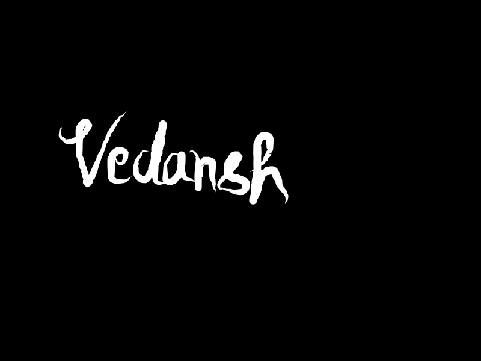
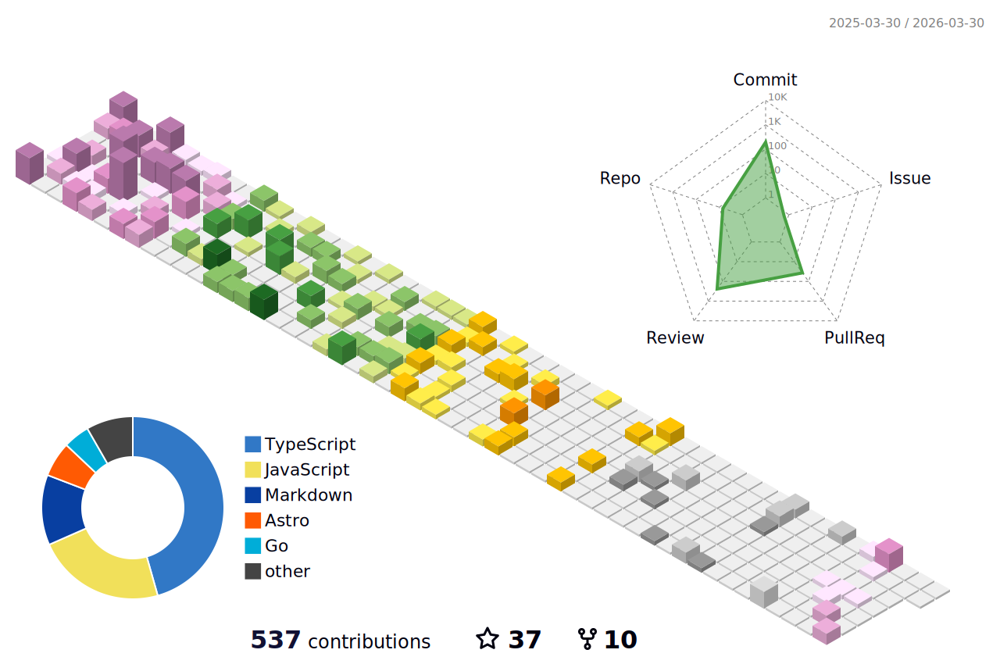

<!-- Copyright by Vedansh (offensive-vk) 2020 - Present. All Rights Reserved. -->
<!-- This Readme Was Specially Handcrafted by @offensive-vk (https://github.com/offensive-vk) -->
<!-- This Readme is translated regularly in 7 Major Languages of the world. -->

   <a href="https://github.com/offensive-vk">
      <picture>
           <source media="(prefers-color-scheme: dark)" srcset="./assets/mine-dark.svg" height="250" width="550" />
           <source media="(prefers-color-scheme: light)" srcset="./assets/mine-light.svg" height="250" width="550" />
           
     </picture>
   </a>

<!--

-->

  

   
    <strong> 
    ·
    <a href="README.md">English</a>
    ·
    <a href="README.es.md">Española</a>
    ·
    <a href="README.fr.md">Français</a>
    ·
    <a href="README.ar.md">عربي</a>
    ·
    <a href="README.de.md">Deutsch</a>
    ·
    <a href="README.zh-CN.md">中国人</a>
    ·
    <a href="README.ru.md">Русский</a>
    ·
    </strong>
  

<!--
 -->

  
<h3>✨ About Me &rarr;</h3>

   
## 💫 About Me:

🔭 _Perfection isn't the goal_.  🧑‍💻 I like to write computer `code`.  🤝 I’m looking for help in my server.  ✨ Living inside the `terminal`.  🌱 I’m currently learning some _nasty_ stuff.  💬 Ask me about nothing.  👌 I respect my time.  ⚡ Fun fact: no fun, only code.  💥 Keep moving and you'll overcome one day.  📧 _You will find a way_.

<!--STARTS_HERE_QUOTE_README-->
<i>❝In 1960, the computer at NORAD warned with 99.9% certainty that the Soviets had just launched a full-scale missile attack against North America. NORAD later discovered that the Early Warning System in Greenland had interpreted the moon rising over Norway as a missile attack from Siberia.❞</i>
<!--ENDS_HERE_QUOTE_README-->

---
<h3 align="left" title="...and I'm happy to see you here :)">🧑‍💻 Languages and Tools: </h3>
    

        
        
        
        
        
        
        
        
        
        
        
        
        
        
        
        
        
        
        
    

<!-- Showing Stuff, that i dont care about lol. have fun -->

  
<h3>🚀 Expecting Something Better? &rarr;</h3>

    

<!-- Outer switch START -->

  
<h4>💻 Click here to See Cool Stuff ⬇️</h4>

    <a href="https://github.com/offensive-vk">
       <picture>
        <source media="(prefers-color-scheme: dark)" srcset="https://ssr-contributions-svg.vercel.app/_/offensive-vk?chart=3dbar&gap=0.6&scale=2&flatten=2&animation=wave&animation_duration=4&animation_delay=0.06&animation_amplitude=24&animation_frequency=0.1&animation_wave_center=0_3&format=svg&weeks=34&theme=native&dark=true">
        <source media="(prefers-color-scheme: light)" srcset="https://ssr-contributions-svg.vercel.app/_/offensive-vk?chart=3dbar&gap=0.6&scale=2&flatten=2&animation=wave&animation_duration=4&animation_delay=0.06&animation_amplitude=24&animation_frequency=0.1&animation_wave_center=0_3&format=svg&weeks=34&theme=native">
        
      </picture>
    </a>

  
<h4>⭐ Achievements & Awards ✅ </h4>

    

  
<h4>💻 Top Languages ✅</h4>

    

  
<h4>⚡ Recent Activity ✅</h4>

    

        
    

<!--START_SECTION:activity-->
1. 🎉 Merged PR [#334](https://github.com/offensive-vk/UntilEverything/pull/334) in [offensive-vk/UntilEverything](https://github.com/offensive-vk/UntilEverything)
2. 🗣 Commented on [#332](https://github.com/offensive-vk/UntilEverything/pull/332#issuecomment-2755158245) in [offensive-vk/UntilEverything](https://github.com/offensive-vk/UntilEverything)
3. 🎉 Merged PR [#333](https://github.com/offensive-vk/UntilEverything/pull/333) in [offensive-vk/UntilEverything](https://github.com/offensive-vk/UntilEverything)
4. 🎉 Merged PR [#14](https://github.com/offensive-vk/Temp/pull/14) in [offensive-vk/Temp](https://github.com/offensive-vk/Temp)
5. ❗ Opened issue [#3](https://github.com/JawherKl/JawherKl/issues/3) in [JawherKl/JawherKl](https://github.com/JawherKl/JawherKl)
6. 💪 Opened PR [#21](https://github.com/offensive-vk/reactjs-quiz-app/pull/21) in [offensive-vk/reactjs-quiz-app](https://github.com/offensive-vk/reactjs-quiz-app)
7. 🎉 Merged PR [#330](https://github.com/offensive-vk/UntilEverything/pull/330) in [offensive-vk/UntilEverything](https://github.com/offensive-vk/UntilEverything)
8. 🎉 Merged PR [#329](https://github.com/offensive-vk/UntilEverything/pull/329) in [offensive-vk/UntilEverything](https://github.com/offensive-vk/UntilEverything)
9. 🎉 Merged PR [#20](https://github.com/offensive-vk/reactjs-quiz-app/pull/20) in [offensive-vk/reactjs-quiz-app](https://github.com/offensive-vk/reactjs-quiz-app)
10. 💪 Opened PR [#20](https://github.com/offensive-vk/reactjs-quiz-app/pull/20) in [offensive-vk/reactjs-quiz-app](https://github.com/offensive-vk/reactjs-quiz-app)
11. 🎉 Merged PR [#19](https://github.com/offensive-vk/reactjs-quiz-app/pull/19) in [offensive-vk/reactjs-quiz-app](https://github.com/offensive-vk/reactjs-quiz-app)
12. 🗣 Commented on [#8363](https://github.com/kamranahmedse/developer-roadmap/issues/8363#issuecomment-2745057668) in [kamranahmedse/developer-roadmap](https://github.com/kamranahmedse/developer-roadmap)
13. 🎉 Merged PR [#30639](https://github.com/offensive-vk/offensive-vk/pull/30639) in [offensive-vk/offensive-vk](https://github.com/offensive-vk/offensive-vk)
14. 💪 Opened PR [#8371](https://github.com/kamranahmedse/developer-roadmap/pull/8371) in [kamranahmedse/developer-roadmap](https://github.com/kamranahmedse/developer-roadmap)
15. 💪 Opened PR [#8369](https://github.com/kamranahmedse/developer-roadmap/pull/8369) in [kamranahmedse/developer-roadmap](https://github.com/kamranahmedse/developer-roadmap)
<!--END_SECTION:activity-->

***
➡️   What? Want More Activity? **[Click Here](./RECENT.md)**

    
<h4>📊 Github Metrics ✅</h4>

    <picture>
        <source media="(prefers-color-scheme: dark)" srcset="./profile-3d-contrib/profile-night-green.svg" width=600 height=400 alt='metrics' />
        <source media="(prefers-color-scheme: light)" srcset="./profile-3d-contrib/profile-green.svg" width=600 height=400 alt='metrics' />
        
    </picture>
    

<!--

  
<h4>👻 Quick Snapshot of Past ✅</h4>

    

-->

    
<h4>🐍 Do you like snakes? ✅</h4>

    

      <picture>
        <source media="(prefers-color-scheme: dark)" srcset="https://github.com/offensive-vk/offensive-vk/blob/master/assets/github-snake-dark.svg" height=250 width=850 alt="snake" />
        <source media="(prefers-color-scheme: light)" srcset="https://github.com/offensive-vk/offensive-vk/blob/master/assets/github-snake-light.svg" height=250 width=850 alt="snake" />
        
     </picture>
    

    
<h4>🐹 CI and Workflow Status ✅</h4>

**Wanna See Everything?** [Click Here](https://github.com/offensive-vk/offensive-vk/actions)

**Wanna See Workflow File?** [Click Here](https://github.com/offensive-vk/offensive-vk/tree/master/WORKFLOWS.md)

**Wanna See Repository Stats?** [Click Here](https://github.com/offensive-vk/offensive-vk/tree/master/STATS.md)

***

  <i>&copy; <a href="https://github.com/offensive-vk/">Vedansh </a> 2023 - Present</i> 
  <i>Licensed under <a href="https://github.com/offensive-vk/offensive-vk/tree/master/LICENSE">GNU Affero General Public License</a></i> 
   
  <kbd>Thanks for visiting :)</kbd>

<!-- Outer switch end -->
<!-- Copyright by Vedansh (offensive-vk) 2020 - Present. All Rights Reserved. -->
<!-- This Readme Was Specially Handcrafted by @offensive-vk (https://github.com/offensive-vk) -->
<!-- Please reach out to me if you want to use this in your personal github profile and make sure to leave a star to help me maintain this Beautiful Profile Repository. -->
