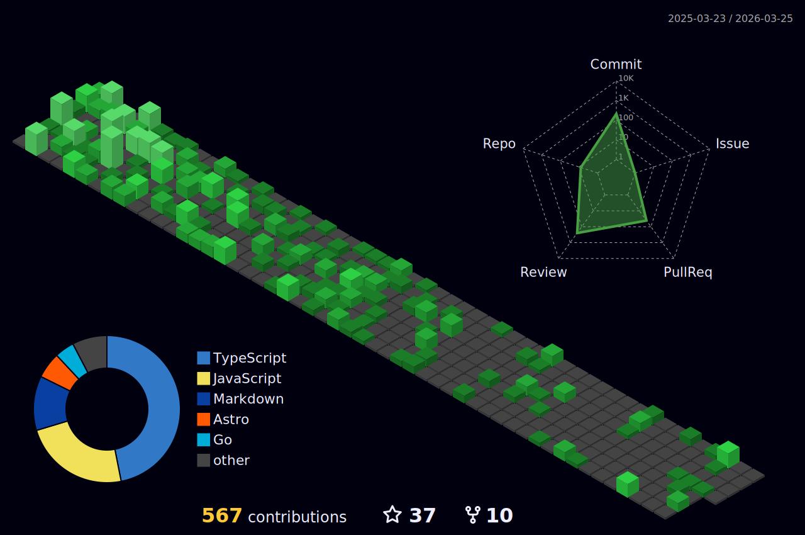

<!-- Copyright by Vedansh (offensive-vk) 2022 - Present. All Rights Reserved. -->

## 💫 About Me:
🔭 _Perfection isn't the goal_. 🧑‍💻 I like to write computer **`code`**. 🤝 I’m looking for help with file management in my computer. ✨ Living inside the `terminal`.  🌱 I’m currently learning some _**nasty**_ stuff.  💬 Ask me about nothing.   👌 My Favorite Programming Language - ASM x86.  ⚡ Fun fact: no fun, only code.   💥 Keep coding & contribute to opensource.   📧 _You will find a way to contact me_.

<!--STARTS_HERE_QUOTE_README-->
<i>❝An Apple laptop stinks. One 2001 iBook model used a glue that, after 12-18 months, may begin to smell like human body odor. It is so strong that repairs are difficult because the smell makes people nauseous.❞</i>
<!--ENDS_HERE_QUOTE_README-->

***
<h3 align="left" title="...and I'm happy to see you here :)">🧑‍💻 Languages and Tools: </h3>
    
 
        
         
         
         
         
        
         
         
         
         
         
         
         
         
         
         
         
        
        
    

  
<b>⚡ Recent Activity</b>

     
    

        
    

    
<!--START_SECTION:activity-->
1. 🎉 Merged PR [#29](https://github.com/offensive-vk/AwesomeCloud/pull/29) in [offensive-vk/AwesomeCloud](https://github.com/offensive-vk/AwesomeCloud)
2. 💪 Opened PR [#19](https://github.com/offensive-vk/offensive-vk/pull/19) in [offensive-vk/offensive-vk](https://github.com/offensive-vk/offensive-vk)
3. 🎉 Merged PR [#18](https://github.com/offensive-vk/offensive-vk/pull/18) in [offensive-vk/offensive-vk](https://github.com/offensive-vk/offensive-vk)
4. 💪 Opened PR [#18](https://github.com/offensive-vk/offensive-vk/pull/18) in [offensive-vk/offensive-vk](https://github.com/offensive-vk/offensive-vk)
5. 🎉 Merged PR [#17](https://github.com/offensive-vk/offensive-vk/pull/17) in [offensive-vk/offensive-vk](https://github.com/offensive-vk/offensive-vk)
6. 🎉 Merged PR [#16](https://github.com/offensive-vk/offensive-vk/pull/16) in [offensive-vk/offensive-vk](https://github.com/offensive-vk/offensive-vk)
7. 🎉 Merged PR [#13](https://github.com/offensive-vk/offensive-vk/pull/13) in [offensive-vk/offensive-vk](https://github.com/offensive-vk/offensive-vk)
8. 🎉 Merged PR [#14](https://github.com/offensive-vk/offensive-vk/pull/14) in [offensive-vk/offensive-vk](https://github.com/offensive-vk/offensive-vk)
9. 🎉 Merged PR [#15](https://github.com/offensive-vk/offensive-vk/pull/15) in [offensive-vk/offensive-vk](https://github.com/offensive-vk/offensive-vk)
10. 🎉 Merged PR [#9](https://github.com/offensive-vk/TypedScript/pull/9) in [offensive-vk/TypedScript](https://github.com/offensive-vk/TypedScript)
11. 🔒 Closed issue [#58](https://github.com/offensive-vk/UntilEverything/issues/58) in [offensive-vk/UntilEverything](https://github.com/offensive-vk/UntilEverything)
12. 🎉 Merged PR [#59](https://github.com/offensive-vk/UntilEverything/pull/59) in [offensive-vk/UntilEverything](https://github.com/offensive-vk/UntilEverything)
13. 🔒 Closed issue [#57](https://github.com/offensive-vk/UntilEverything/issues/57) in [offensive-vk/UntilEverything](https://github.com/offensive-vk/UntilEverything)
14. 🎉 Merged PR [#60](https://github.com/offensive-vk/UntilEverything/pull/60) in [offensive-vk/UntilEverything](https://github.com/offensive-vk/UntilEverything)
15. 🔒 Closed issue [#49](https://github.com/offensive-vk/UntilEverything/issues/49) in [offensive-vk/UntilEverything](https://github.com/offensive-vk/UntilEverything)
<!--END_SECTION:activity-->

***
➡️  **[Click Here To See More Activity](assets/RECENT.md)**

 

    
<b>📊 Github Metrics</b>

    

<!--
 

-->

 

    
<b>🐍 Do you like snakes?</b>

    

        
    

***

  <i>&copy; <a href="https://github.com/offensive-vk/">Vedansh </a> 2023 - Present</i> 
  <i>Licensed under <a href="https://mit-license.org/">MIT</a></i> 
   
  <kbd>Thanks for visiting :)</kbd>

<!-- Copyright by Vedansh (offensive-vk) 2022 - Present. All Rights Reserved. -->
