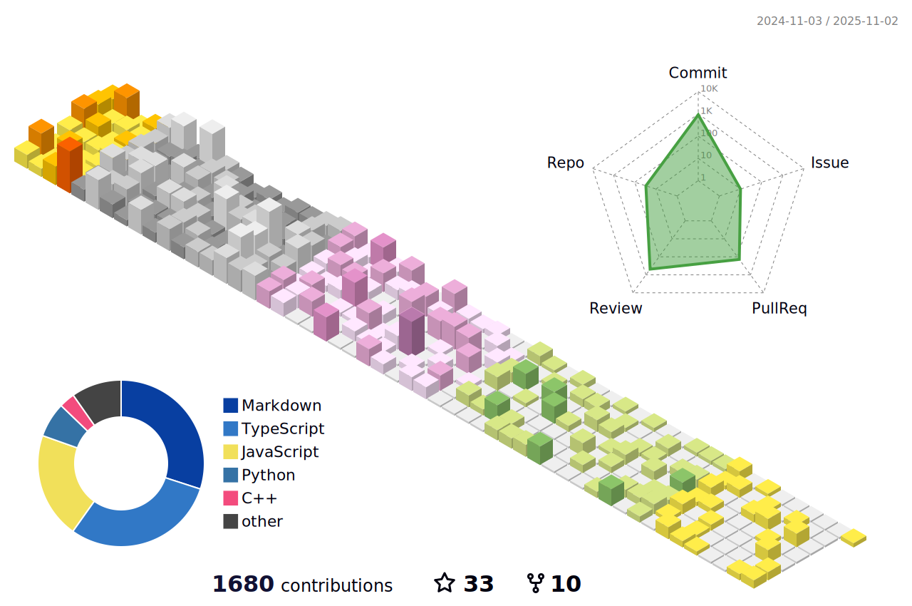

<!-- Copyright by Vedansh (offensive-vk) 2020 - Present. All Rights Reserved. -->
<!-- This Readme Was Specially Handcrafted by @offensive-vk (https://github.com/offensive-vk) -->

   <a href="https://github.com/offensive-vk">
      <picture>
           <source media="(prefers-color-scheme: dark)" srcset="./assets/mine-dark.svg" height="350" width="650" />
           <source media="(prefers-color-scheme: light)" srcset="./assets/mine-light.svg" height="350" width="650" />
           
     </picture>
   </a>

<!--
 -->

## 💫 About Me:
🔭 _Perfection isn't the goal_. 🧑‍💻 I like to write computer **`code`**. 🤠I’m looking for help with file management in my computer. ✨ Living inside the `terminal`.  🌱 I’m currently learning some _**nasty**_ stuff.  💬 Ask me about nothing.   👌 My Favorite Programming Language - ASM x86.  âš¡ Fun fact: no fun, only code.   💥 Keep moving and you'll overcome one day.   📧 _You will find a way to contact me_.

<!--STARTS_HERE_QUOTE_README-->
<i>❝There is a video game, called “Lose/Lose” that deletes a random file on your computer every time you kill an enemy.❞</i>
<!--ENDS_HERE_QUOTE_README-->

***
<h3 align="left" title="...and I'm happy to see you here :)">🧑‍💻 Languages and Tools: </h3>
    

        
        
        
        
        
        
        
        
        
        
        
        
        
        
        
        
        
        
        
    

<!-- Showing Stuff, that i dont care about lol. have fun -->

  
<h3>🚀 Expecting Something Better? Expand for more !</h3>

    

<!-- Outer switch START -->

  
<h4>💻 Click here to See Cool Stuff ⬇️</h4>

    <a href="https://github.com/offensive-vk">
       <picture>
        <source media="(prefers-color-scheme: dark)" srcset="https://ssr-contributions-svg.vercel.app/_/offensive-vk?chart=3dbar&gap=0.6&scale=2&flatten=2&animation=wave&animation_duration=4&animation_delay=0.06&animation_amplitude=24&animation_frequency=0.1&animation_wave_center=0_3&format=svg&weeks=34&theme=native&dark=true">
        <source media="(prefers-color-scheme: light)" srcset="https://ssr-contributions-svg.vercel.app/_/offensive-vk?chart=3dbar&gap=0.6&scale=2&flatten=2&animation=wave&animation_duration=4&animation_delay=0.06&animation_amplitude=24&animation_frequency=0.1&animation_wave_center=0_3&format=svg&weeks=34&theme=native">
        
      </picture>
    </a>

  
<h4>⭠Achievements & Awards ✅ </h4>

    

  
<h4>💻 Top Languages ✅</h4>

    

  
<h4>⚡ Recent Activity ✅</h4>

    

        
    

<!--START_SECTION:activity-->
1. 🎉 Merged PR [#103](https://github.com/offensive-vk/offensive-vk/pull/103) in [offensive-vk/offensive-vk](https://github.com/offensive-vk/offensive-vk)
2. 🎉 Merged PR [#2](https://github.com/offensive-vk/ts-action-starter/pull/2) in [offensive-vk/ts-action-starter](https://github.com/offensive-vk/ts-action-starter)
3. 🎉 Merged PR [#1](https://github.com/offensive-vk/ts-action-starter/pull/1) in [offensive-vk/ts-action-starter](https://github.com/offensive-vk/ts-action-starter)
4. 🎉 Merged PR [#3](https://github.com/offensive-vk/ts-action-starter/pull/3) in [offensive-vk/ts-action-starter](https://github.com/offensive-vk/ts-action-starter)
5. 💪 Opened PR [#3](https://github.com/offensive-vk/ts-action-starter/pull/3) in [offensive-vk/ts-action-starter](https://github.com/offensive-vk/ts-action-starter)
6. 🚀 Published release [v5](https://github.com/offensive-vk/auto-repo-sync/releases/tag/v5) in [offensive-vk/auto-repo-sync](https://github.com/offensive-vk/auto-repo-sync)
7. 🎉 Merged PR [#2](https://github.com/offensive-vk/auto-repo-sync/pull/2) in [offensive-vk/auto-repo-sync](https://github.com/offensive-vk/auto-repo-sync)
8. 💪 Opened PR [#2](https://github.com/offensive-vk/auto-repo-sync/pull/2) in [offensive-vk/auto-repo-sync](https://github.com/offensive-vk/auto-repo-sync)
9. 🎉 Merged PR [#1](https://github.com/offensive-vk/auto-label/pull/1) in [offensive-vk/auto-label](https://github.com/offensive-vk/auto-label)
10. 💪 Opened PR [#1](https://github.com/offensive-vk/auto-label/pull/1) in [offensive-vk/auto-label](https://github.com/offensive-vk/auto-label)
11. 🎉 Merged PR [#2](https://github.com/offensive-vk/auto-commit-push/pull/2) in [offensive-vk/auto-commit-push](https://github.com/offensive-vk/auto-commit-push)
12. 💪 Opened PR [#2](https://github.com/offensive-vk/auto-commit-push/pull/2) in [offensive-vk/auto-commit-push](https://github.com/offensive-vk/auto-commit-push)
13. 🎉 Merged PR [#4](https://github.com/offensive-vk/auto-stats/pull/4) in [offensive-vk/auto-stats](https://github.com/offensive-vk/auto-stats)
14. 🎉 Merged PR [#3](https://github.com/offensive-vk/auto-stats/pull/3) in [offensive-vk/auto-stats](https://github.com/offensive-vk/auto-stats)
15. 🎉 Merged PR [#2](https://github.com/offensive-vk/auto-stats/pull/2) in [offensive-vk/auto-stats](https://github.com/offensive-vk/auto-stats)
<!--END_SECTION:activity-->

***
➡️   What? Want More Activity? **[Click Here](./RECENT.md)**

    
<h4>📊 Github Metrics ✅</h4>

    <picture>
        <source media="(prefers-color-scheme: dark)" srcset="./profile-3d-contrib/profile-night-green.svg" width=600 height=400 alt='metrics' />
        <source media="(prefers-color-scheme: light)" srcset="./profile-3d-contrib/profile-green.svg" width=600 height=400 alt='metrics' />
        
    </picture>
    

<!--

  
<h4>👻 Quick Snapshot of Past ✅</h4>

    

-->

    
<h4>🐍 Do you like snakes? ✅</h4>

    

      <picture>
        <source media="(prefers-color-scheme: dark)" srcset="https://github.com/offensive-vk/offensive-vk/blob/master/assets/github-snake-dark.svg" height=250 width=850 alt="snake" />
        <source media="(prefers-color-scheme: light)" srcset="https://github.com/offensive-vk/offensive-vk/blob/master/assets/github-snake-light.svg" height=250 width=850 alt="snake" />
        
     </picture>
    

    
<h4>🹠CI and Workflow Status ✅</h4>

**Wanna See Everything?** [Click Here](https://github.com/offensive-vk/offensive-vk/actions)

**Wanna See Workflow File?** [Click Here](https://github.com/offensive-vk/offensive-vk/tree/master/WORKFLOWS.md)

**Wanna See Repository Stats?** [Click Here](https://github.com/offensive-vk/offensive-vk/tree/master/STATS.md)

***

  <i>&copy; <a href="https://github.com/offensive-vk/">Vedansh </a> 2023 - Present</i> 
  <i>Licensed under <a href="https://github.com/offensive-vk/offensive-vk/tree/master/LICENSE">GNU Affero General Public License</a></i> 
   
  <kbd>Thanks for visiting :)</kbd>

<!-- Outer switch end -->
<!-- Copyright by Vedansh (offensive-vk) 2020 - Present. All Rights Reserved. -->
<!-- This Readme Was Specially Handcrafted by @offensive-vk (https://github.com/offensive-vk) -->