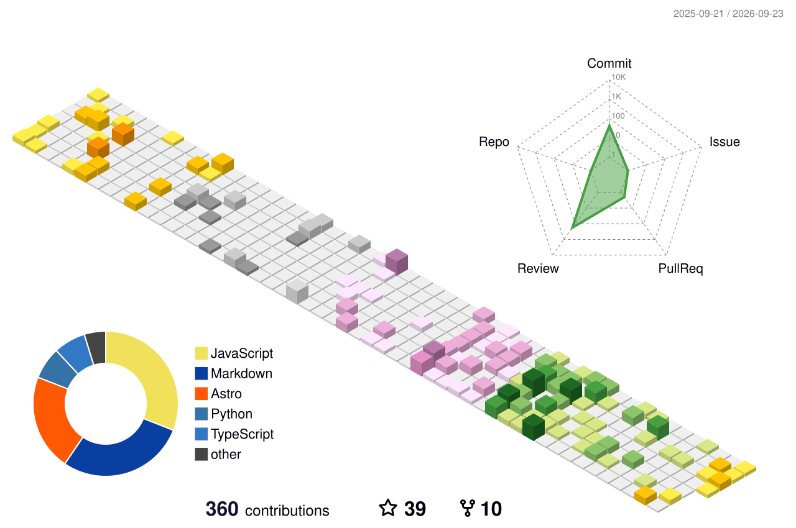

<!-- Copyright by Vedansh (offensive-vk) 2020 - Present. All Rights Reserved. -->

<!-- This Readme Was Specially Handcrafted by @offensive-vk (https://github.com/offensive-vk) -->

<!-- This Readme is translated regularly in 7 Major Languages of the world. -->

   <a href="https://github.com/offensive-vk">
      <picture>
           <source media="(prefers-color-scheme: dark)" srcset="./assets/mine-dark.svg" height="250" width="550" />
           <source media="(prefers-color-scheme: light)" srcset="./assets/mine-light.svg" height="250" width="550" />
           
     </picture>
   </a>

<!--

-->

  

   
    <strong> 
    ·
    <a href="README.md">English</a>
    ·
    <a href="README.es.md">Española</a>
    ·
    <a href="README.fr.md">Français</a>
    ·
    <a href="README.ar.md">عربي</a>
    ·
    <a href="README.de.md">Deutsch</a>
    ·
    <a href="README.zh-CN.md">中国人</a>
    ·
    <a href="README.ru.md">Русский</a>
    ·
    </strong>
  

<!--
 -->

  
<h3>✨ About Me &rarr;</h3>

   
## 💫 About Me:

🔭_完美并不是`goal`_. 🧑‍💻 我喜欢审核电脑&`code`. 🤝 我是。 ✨ 住在里面`terminal`. 🌱我现在正在学习_法学硕士_东西。 💬 询问我有关自动化的问题。 ⚡ 有趣的事实：没有乐趣，只有日志。 💥 别想，只做。 📧_你会找到办法_.

<!--STARTS_HERE_QUOTE_README-->

<i>❝“如果您的程序有十个参数，您可能会错过一些参数。”— Alan Perlis ❞</i>

<!--ENDS_HERE_QUOTE_README-->

* * *

<h3 align="left" title="...and I'm happy to see you here :)">🧑‍💻 Languages and Tools: </h3>
    

        
        
        
        
        
        
        
        
        
        
        
        
        
        
        
        
        
        
        
    

<!-- Showing Stuff, that i dont care about lol. have fun -->

  
<h3>🚀 Expecting Something Better? &rarr;</h3>

    

<!-- Outer switch START -->

  
<h4>💻 Click here to See ⬇️</h4>

    <a href="https://github.com/offensive-vk">
       <picture>
        <source media="(prefers-color-scheme: dark)" srcset="https://ssr-contributions-svg.vercel.app/_/offensive-vk?chart=3dbar&gap=0.6&scale=2&flatten=2&animation=wave&animation_duration=4&animation_delay=0.06&animation_amplitude=24&animation_frequency=0.1&animation_wave_center=0_3&format=svg&weeks=34&theme=native&dark=true">
        <source media="(prefers-color-scheme: light)" srcset="https://ssr-contributions-svg.vercel.app/_/offensive-vk?chart=3dbar&gap=0.6&scale=2&flatten=2&animation=wave&animation_duration=4&animation_delay=0.06&animation_amplitude=24&animation_frequency=0.1&animation_wave_center=0_3&format=svg&weeks=34&theme=native">
        
      </picture>
    </a>

  
<h4>⭐ Achievements & Awards ✅ </h4>

    

  
<h4>💻 Top Languages ✅</h4>

    

  
<h4>⚡ Recent Activity ✅</h4>

    

        
    

<!--START_SECTION:activity-->

1.  🗣 已发表评论[#469](https://github.com/offensive-vk/UntilEverything/pull/469#issuecomment-5239798876)在[进攻-vk/UntilEverything](https://github.com/offensive-vk/UntilEverything)
2.  🗣 已发表评论[#475](https://github.com/offensive-vk/UntilEverything/pull/475#issuecomment-5239787084)在[进攻-vk/UntilEverything](https://github.com/offensive-vk/UntilEverything)
3.  🔒 已关闭问题[#31064](https://github.com/offensive-vk/offensive-vk/issues/31064)在[进攻-vk/进攻-vk](https://github.com/offensive-vk/offensive-vk)
4.  🔒 已关闭问题[#31063](https://github.com/offensive-vk/offensive-vk/issues/31063)在[进攻-vk/进攻-vk](https://github.com/offensive-vk/offensive-vk)
5.  🔒 已关闭问题[#31062](https://github.com/offensive-vk/offensive-vk/issues/31062)在[进攻-vk/进攻-vk](https://github.com/offensive-vk/offensive-vk)
6.  🔒 已关闭问题[#31061](https://github.com/offensive-vk/offensive-vk/issues/31061)在[进攻-vk/进攻-vk](https://github.com/offensive-vk/offensive-vk)
7.  🔒 已关闭问题[#31059](https://github.com/offensive-vk/offensive-vk/issues/31059)在[进攻-vk/进攻-vk](https://github.com/offensive-vk/offensive-vk)
8.  🔒 已关闭问题[#31058](https://github.com/offensive-vk/offensive-vk/issues/31058)在[进攻-vk/进攻-vk](https://github.com/offensive-vk/offensive-vk)
9.  🔒 已关闭问题[#31056](https://github.com/offensive-vk/offensive-vk/issues/31056)在[进攻-vk/进攻-vk](https://github.com/offensive-vk/offensive-vk)
10. 🔒 已关闭问题[#31054](https://github.com/offensive-vk/offensive-vk/issues/31054)在[进攻-vk/进攻-vk](https://github.com/offensive-vk/offensive-vk)
11. 🔒 已关闭问题[#31052](https://github.com/offensive-vk/offensive-vk/issues/31052)在[进攻-vk/进攻-vk](https://github.com/offensive-vk/offensive-vk)
12. 🗣 已发表评论[#462](https://github.com/offensive-vk/UntilEverything/pull/462#issuecomment-4945468541)在[进攻-vk/UntilEverything](https://github.com/offensive-vk/UntilEverything)
13. 🗣 已发表评论[#464](https://github.com/offensive-vk/UntilEverything/pull/464#issuecomment-4945454616)在[进攻-vk/UntilEverything](https://github.com/offensive-vk/UntilEverything)
14. 🔒 已关闭问题[#5](https://github.com/offensive-vk/Temp/issues/5)在[进攻-vk/Temp](https://github.com/offensive-vk/Temp)
15. 🔒 已关闭问题[#4](https://github.com/offensive-vk/Temp/issues/4)在[进攻-vk/Temp](https://github.com/offensive-vk/Temp)
    <!--END_SECTION:activity-->

* * *

➡️什么？想要更多活动吗？**[点击这里](./RECENT.md)**

    
<h4>📊 Github Metrics ✅</h4>

    <picture>
        <source media="(prefers-color-scheme: dark)" srcset="./profile-3d-contrib/profile-night-green.svg" width=600 height=400 alt='metrics' />
        <source media="(prefers-color-scheme: light)" srcset="./profile-3d-contrib/profile-green.svg" width=600 height=400 alt='metrics' />
        
    </picture>
    

<!--

-->

  
<h4>👻 What did I do? ✅</h4>

    

    
<h4>🐍 Do you like snakes? ✅</h4>

    

      <picture>
        <source media="(prefers-color-scheme: dark)" srcset="https://github.com/offensive-vk/offensive-vk/blob/master/assets/github-snake-dark.svg" height=250 width=850 alt="snake" />
        <source media="(prefers-color-scheme: light)" srcset="https://github.com/offensive-vk/offensive-vk/blob/master/assets/github-snake-light.svg" height=250 width=850 alt="snake" />
        
     </picture>
    

    
<h4>🐹 CI and Workflow Status ✅</h4>

**想看到一切吗？**[点击这里](https://github.com/offensive-vk/offensive-vk/actions)

**想查看工作流程文件吗？**[点击这里](https://github.com/offensive-vk/offensive-vk/tree/master/WORKFLOWS.md)

**想查看存储库统计信息吗？**[点击这里](https://github.com/offensive-vk/offensive-vk/tree/master/STATS.md)

* * *

  <i>&copy; <a href="https://github.com/offensive-vk/">Vedansh </a> 2023 - Present</i> 
  <i>Licensed under <a href="https://github.com/offensive-vk/offensive-vk/tree/master/LICENSE">GNU Affero General Public License</a></i> 
   
  <kbd>Thanks for visiting :)</kbd>

<!-- Outer switch end -->

<!-- Copyright by Vedansh (offensive-vk) 2020 - Present. All Rights Reserved. -->

<!-- This Readme Was Specially Handcrafted by @offensive-vk (https://github.com/offensive-vk) -->

<!-- Please reach out to me if you want to use this in your personal github profile and make sure to leave a star to help me maintain this Beautiful Profile Repository. -->
